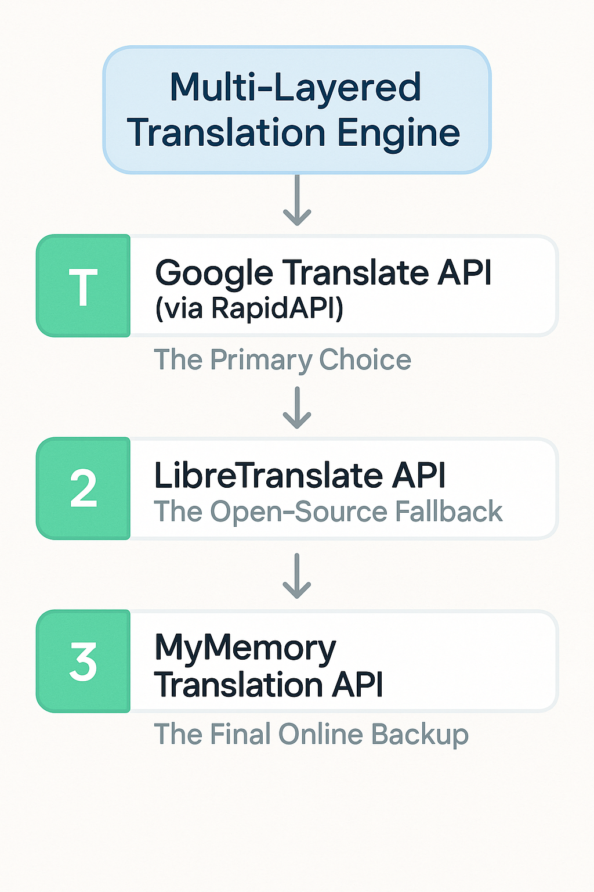

# VoiceBridge - Real-Time Voice Translator

VoiceBridge is a web-based application that enables real-time voice translation between multiple languages. It uses speech recognition and translation APIs to provide seamless communication across language barriers.

## Features

- Real-time voice recognition
- Translation between multiple languages
- Text-to-speech for translated content
- Push-to-talk functionality
- Translation history with local storage
- Responsive design for mobile and desktop

## Supported Languages

- Telugu
- Hindi
- English
- Tamil
- Kannada
- French
- Spanish
- German
- Japanese
- Chinese

## Technologies Used

- HTML5
- CSS3 with Tailwind CSS
- JavaScript (Vanilla)
- Web Speech API
- Translation APIs
- LocalStorage for history persistence

## Resilient Translation Engine (Multi-Layered Fallback System)

The core of this application is a fault-tolerant translation engine designed for high availability. Instead of relying on a single API, which creates a single point of failure, VoiceBridge implements a "waterfall" or "fallback" system. It attempts to use a series of translation services in a prioritized order. If the primary API fails, it automatically and seamlessly tries the next one in the chain, ensuring the user almost always receives a translation.

This architecture makes the application robust, reliable, and cost-effective.

### Architecture Diagram



### How It Works

The logic is contained within the `translateText` function in `index.html`. It uses a series of `try...catch` blocks to call the APIs in sequence. A successful call immediately returns the result and exits the function. A failed call is caught, and execution "falls through" to the next block.

1.  **Layer 1: Google Translate API (via RapidAPI)** - The primary choice for its high accuracy.
2.  **Layer 2: LibreTranslate API** - A free, open-source fallback if Google Translate is unavailable.
3.  **Layer 3: MyMemory API** - A final online backup with a generous free tier.
4.  **Final Fallback:** If all online APIs fail, a basic local dictionary provides translations for common phrases.

### Code Implementation

A simplified view of the fallback logic in `translateText()`:

```javascript
async function translateText(text) {
  // ... setup code ...

  try {
    // ===============================================================
    // LAYER 1: Google Translate API via RapidAPI
    // ===============================================================
    try {
      // ... code to call Google Translate ...
      if (/* call is successful */) {
        // ... process data ...
        return; // Success, exit the function
      }
    } catch (apiError) {
      // Log error and fall through to the next layer
    }

    // ===============================================================
    // LAYER 2: LibreTranslate API (Open-Source Fallback)
    // ===============================================================
    try {
      // ... code to call LibreTranslate ...
      if (/* call is successful */) {
        // ... process data ...
        return; // Success, exit the function
      }
    } catch (libreError) {
      // Log error and fall through to the next layer
    }

    // ===============================================================
    // LAYER 3: MyMemory Translation API (Final Online Backup)
    // ===============================================================
    try {
      // ... code to call MyMemory ...
      if (/* call is successful */) {
        // ... process data ...
        return; // Success, exit the function
      }
    } catch (myMemoryError) {
      // Log error and fall through to the final fallback
    }

    // ===============================================================
    // FINAL FALLBACK: Local dictionary lookup
    // ===============================================================
    // ... code for basic local translation ...

  } catch (error) {
    // ... handle general errors ...
  } finally {
    // ... final UI updates ...
  }
}
```

## Getting Started

1. Clone the repository:

   ```
   git clone https://github.com/SurajMandal14/LiveTranslationApp.git
   ```

2. Open `index.html` or `trans.html` in your web browser.

That's it! No build process or additional dependencies are required.

## Usage

1. Select source and target languages from the dropdown menus
2. Press and hold the microphone button to speak
3. Release the button to stop recording
4. View the translation and click "Play Translation" to hear it
5. Access all translation history by clicking "View All History"

## API Configuration

The application is designed to work with several translation APIs:

1. Google Translate API via RapidAPI (requires API key)
2. LibreTranslate API (open source)
3. MyMemory Translation API (free tier)

To use Google Translate API, replace "YOUR_RAPIDAPI_KEY" in the code with your actual RapidAPI key.

## Browser Compatibility

This application works best in modern browsers that support the Web Speech API:

- Google Chrome
- Microsoft Edge
- Safari (partial support)
- Firefox (partial support)

## License

This project is open-source and available under the MIT License.

## Developer

Developed by Suraj Mandal from Janakpurdham, Nepal.

## Connect With Me

- [GitHub](https://github.com/SurajMandal14)
- [Facebook](https://www.facebook.com/profile.php?id=100010812571636)
- [Instagram](https://www.instagram.com/_surajzmandal/)

## Contact

For any questions or suggestions, reach out to me at mandalsuraj048@gmail.com.
